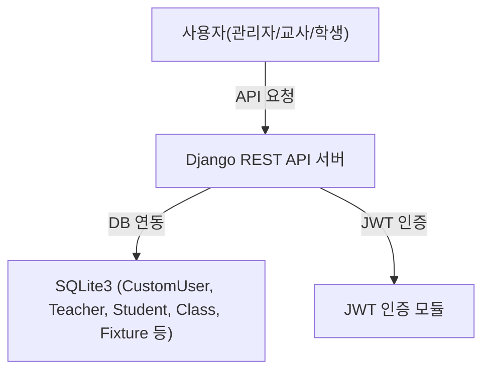
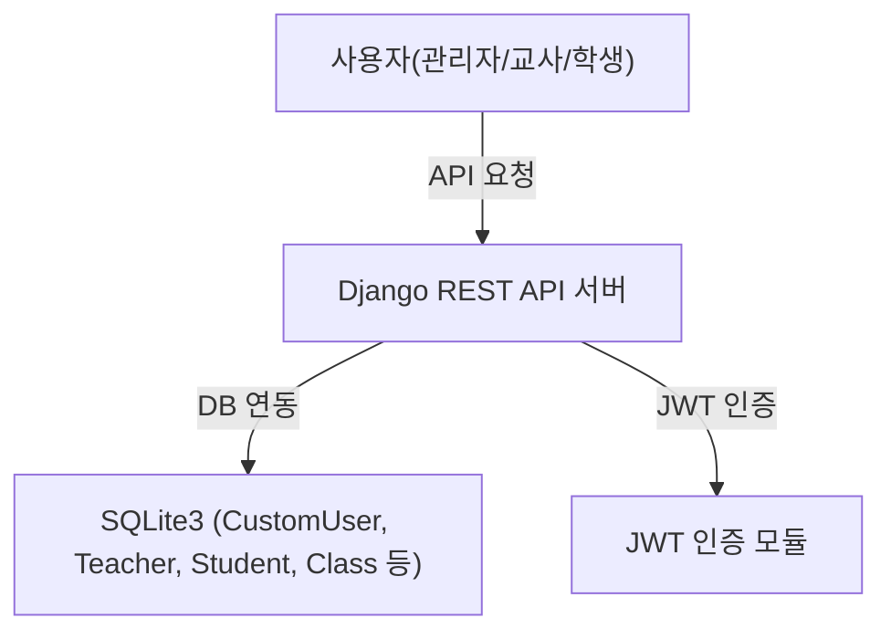

# 학원 관리 시스템 API 명세서

## 1. URL 구조 안내
- 
- 모든 엔드포인트는 `/api/`로 시작합니다. (예: `/api/auth/`, `/api/students/`)
- 버전이 추가될 경우 `/api/v2/` 등으로 확장 가능합니다.

---

- 인증/계정: `/api/auth/`
- 학생: `/api/students/`
- 교사: `/api/teachers/`
- 관리자: `/api/admin/`
- 비품(고정자산):`/api/teachers/fixures/` (교사/관리자용 조회), `/api/admin/fixtures` (관리자용 CRUD)
## 2. 전체 시스템 구조 및 데이터베이스(ERD)

### 2-1. 전체 시스템 다이어그램


- **비품(고정자산, Fixture) 관리**: 관리자(및 교사)는 비품 목록을 조회하고, 관리자는 비품을 등록/수정/삭제할 수 있습니다. 비품 정보는 Fixture 테이블에 저장됩니다.

### 2-2. ERD(데이터베이스 구조) 다이어그램
```mermaid
erDiagram
    CustomUser ||--o{ Teacher : "1:N"
    CustomUser ||--o{ Manager : "1:N"
    Teacher ||--o{ Class : "1:N"
    ClassRoom ||--o{ Class : "1:N"
    Class ||--o{ Schedule : "1:N"
    Class ||--o{ Student : "N:M"
    Student }o--o{ Class : "N:M"
    Fixture
```

**Fixture 엔티티 필드**
| 필드명 | 설명   |
|--------|--------|
| name   | 비품명 |
| price  | 가격   |
| count  | 수량   |

- **CustomUser**: username, role(teacher/admin)
- **Teacher**: CustomUser(외래키), 이름, 나이, 직책, 성별
- **Manager**: CustomUser(외래키), 이름, 직책
- **Student**: id, class_id, name, email, birth_date, gender
- **ClassRoom**: id, classroom
- **Class**: class_name, class_time, classroom(외래키), teacher(외래키), students(ManyToMany)
- **Schedule**: class(외래키), name, date, todo
- **Fixture**: name(비품명), price(가격), count(수량)

---

## 2-3. 주요 앱별 API 구현

- **계정/인증 (acounts)**: 사용자(교사/관리자) 등록, JWT 인증, 로그인/로그아웃/토큰 갱신 등
- **학생 관리 (students)**: 학생 정보 CRUD
- **교사 관리 (teachers)**: 교사 정보, 학생/수업/리포트/공지 등 교사 관련 기능
- **수업 관리 (classes)**: 수업 및 스케줄(할 일) 등록/관리
- **관리자(매니저) 관리 (managers)**: 관리자 정보 및 전체 통합 관리(교사/학생/수업/비품)
- **비품(고정자산) 관리 (managers, teachers)**: 관리자(등록/수정/삭제), 교사/관리자(목록 조회)

### 각 앱별 주요 기능
- **계정/인증 (acounts)**
    - 사용자 등록, JWT 인증, 로그인/로그아웃/토큰 갱신
- **학생 관리 (students)**
    - 학생 정보 등록, 조회, 수정, 삭제
- **교사 관리 (teachers)**
    - 교사 정보 관리, 학생/수업/리포트/공지 등 교사 기능
- **수업 관리 (classes)**
    - 수업 및 스케줄(할 일) 등록/관리
- **관리자(매니저) 관리 (managers)**
    - 관리자 정보 및 전체 통합 관리(교사/학생/수업/비품)
- **비품(고정자산) 관리 (managers, teachers)**
    - Fixture 모델을 통한 비품 등록/수정/삭제(관리자), 목록 조회(교사/관리자)
    - 관련 API: `/api/teachers/fixures/`, `/api/admin/fixtures`

---

## 3. 엔드포인트/권한/상태코드 요약 표

### 3-1. 엔드포인트별 실제 URL(라우팅) 및 권한
| 구분      | URL 패턴                        | HTTP Method | 설명                | 권한/역할 제한         |
|-----------|---------------------------------|-------------|---------------------|------------------------|
| 회원가입  | `/api/auth/register/`           | POST        | 계정 등록           | 누구나(비로그인)        |
| 로그인    | `/api/auth/login/`              | POST        | JWT 토큰 발급       | 누구나(비로그인)        |
| 토큰갱신  | `/api/auth/refresh/`            | POST        | 토큰 갱신           | 누구나(비로그인)        |
| 로그아웃  | `/api/auth/logout/`             | POST        | 토큰 블랙리스트     | 로그인(토큰 필요)      |
| 학생목록  | `/api/students/`                | GET         | 학생 전체 조회      | 관리자, 교사           |
| 학생등록  | `/api/students/`                | POST        | 학생 등록           | 관리자, 교사           |
| 학생수정  | `/api/students/`                | PATCH       | 학생 정보 수정      | 관리자, 교사           |
| 학생삭제  | `/api/students/`                | DELETE      | 학생 삭제           | 관리자, 교사           |
| 교사공지  | `/api/teachers/reports/`        | POST        | 학생별 공지/리포트  | 교사                   |
| 교사수업  | `/api/teachers/classes/`        | GET         | 교사별 수업 목록    | 교사                   |
| 수업생성  | `/api/classes/schedule/`        | POST        | 수업+스케줄 등록    | 관리자, 교사           |
| 비품조회  | `/api/teachers/fixures/`        | GET         | 비품 목록 조회      | 교사, 관리자           |
| 비품CRUD  | `/api/admin/fixtures` 등         | GET/POST/PATCH/DELETE | 비품 관리 | 관리자           |

### 3-2. 권한/역할별 접근 제한 표
| 엔드포인트                        | 접근 권한/역할 제한                |
|-----------------------------------|-------------------------------------|
| `/api/auth/register/`             | 누구나(비로그인)                    |
| `/api/auth/login/`                | 누구나(비로그인)                    |
| `/api/auth/refresh/`              | 누구나(비로그인)                    |
| `/api/auth/logout/`               | 로그인 사용자(JWT 필요)             |
| `/api/students/` (GET)            | 관리자, 교사(로그인/JWT 필요)       |
| `/api/students/` (POST)           | 관리자, 교사(로그인/JWT 필요)       |
| `/api/students/` (PATCH)          | 관리자, 교사(로그인/JWT 필요)       |
| `/api/students/` (DELETE)         | 관리자, 교사(로그인/JWT 필요)       |
| `/api/teachers/reports/`          | 교사(로그인/JWT 필요)               |
| `/api/teachers/classes/`          | 교사(로그인/JWT 필요)               |
| `/api/classes/schedule/`          | 관리자, 교사(로그인/JWT 필요)       |
| `/api/admin/` 관련                | 관리자(로그인/JWT 필요)             |

### 3-3. 상태코드(HTTP Status Code) 표
| API 엔드포인트                | 성공 코드 | 실패 코드 및 상황                  |
|------------------------------|-----------|------------------------------------|
| /api/auth/register/          | 201       | 400(유효성 실패, 중복), 500(서버)  |
| /api/auth/login/             | 200       | 400(비밀번호 오류), 404(미존재)    |
| /api/auth/logout/            | 205       | 400(토큰 오류), 401(인증 실패)     |
| /api/students/ (GET)         | 200       | 401(인증 실패), 500(서버)          |
| /api/students/ (POST)        | 201       | 400(유효성 실패), 401(인증 실패)   |
| /api/students/ (PATCH)       | 200       | 400(유효성 실패), 404(미존재)      |
| /api/students/ (DELETE)      | 204       | 400(요청 오류), 404(미존재)        |
| /api/teachers/reports/       | 200       | 400(요청 오류), 401(인증 실패)     |
| /api/classes/schedule/       | 201       | 400(유효성 실패), 401(인증 실패)   |
| /api/admin/fixtures (GET)    | 200       | 401(인증 실패)                     |
| /api/admin/fixtures (POST)   | 201       | 400(유효성 실패), 401(인증 실패)   |
| /api/admin/fixtures/<itemId> (PATCH) | 200 | 400(유효성 실패), 404(미존재)      |
| /api/admin/fixtures/<itemId> (DELETE) | 204 | 404(미존재), 401(인증 실패)        |

---

## 4. API별 상세 설명 (입력값 제약조건/반환값 설명)

### 회원가입
- **목적**: 신규 사용자(교사/관리자) 등록
- **입력값**: username(필수, 100자 이내, 중복 불가), password(필수), role("teacher" 또는 "admin")
- **반환값**: 성공 시 메시지, 실패 시 에러 상세

### 로그인
- **목적**: JWT 토큰 발급(로그인)
- **입력값**: username, password, role
- **반환값**: access/refresh 토큰, role, id

### 학생 등록
- **목적**: 학생 정보 등록
- **입력값**: class_id(필수), name(필수), email(필수, 중복 불가), birth_date(8자리 숫자), gender("male"/"female")
- **반환값**: 등록된 학생 정보, 메시지

### 학생 정보 수정
- **목적**: 학생 정보 일부 수정
- **입력값**: id(필수), 수정할 필드(예: email)
- **반환값**: 수정된 학생 정보, 메시지

### 학생 삭제
- **목적**: 학생 정보 삭제
- **입력값**: id(필수)
- **반환값**: 성공 메시지

### 교사 공지/리포트 전송
- **목적**: 학생별 공지/리포트 전송
- **입력값**: 공통 메시지, recipients(학생ID, 개인 메시지)
- **반환값**: 전송 결과, 성공/실패 내역

### 수업 및 스케줄 생성
- **목적**: 새로운 수업과 할 일(스케줄) 동시 등록
- **입력값**: classroom, teacherName, className, daysOfWeek, todos(할 일 목록)
- **반환값**: 생성된 수업 ID, 메시지

### 비품 등록/수정/삭제
- **목적**: 비품(고정자산) 정보 관리
- **입력값**: name(필수), price(양의 정수), count(양의 정수)
- **반환값**: 등록/수정/삭제된 비품 정보, 메시지

---

## 5. 에러 응답 예시

- **권한 없음(401/403)**
```json
{
  "detail": "You do not have permission to perform this action"
}
```
- **유효성 실패(400)**
```json
{
  "message": "잘못된 요청입니다.",
  "errors": {
    "email": ["이미 존재하는 이메일입니다."]
  }
}
```
- **토큰 오류(400/401)**
```json
{
  "error": "Token is invalid or expired"
}
```
- **리소스 미존재(404)**
```json
{
  "detail": "Not found."
}
```
- **서버 내부 오류(500)**
```json
{
  "message": "서버 내부 오류가 발생했습니다.",
  "error": "Exception details..."
}
```

---

## 6. API별 시나리오 예시

### (1) 회원가입 → 로그인 → 학생등록

1. **회원가입**
   - `POST /api/auth/register/`
   - 요청: `{ "username": "admin1", "password": "pw1234", "role": "admin" }`
   - 응답: `{ "message": "User registered successfully" }`

2. **로그인**
   - `POST /api/auth/login/`
   - 요청: `{ "username": "admin1", "password": "pw1234", "role": "admin" }`
   - 응답: `{ "access": "...", "refresh": "...", ... }`

3. **학생 등록**
   - `POST /api/students/` (헤더에 `Authorization: Bearer <access>` 포함)
   - 요청: `{ "class_id": 101, "name": "홍길동", "email": "hong@naver.com", "birth_date": 20001010, "gender": "male" }`
   - 응답: `{ "message": "학생이 성공적으로 등록되었습니다.", "student": {...} }`

---

### (2) 교사 로그인 → 공지 전송

1. **교사 로그인**
   - `POST /api/teachers/login/`
   - 요청: `{ "teacher_id": "teacher01" }`
   - 응답: `{ "access_token": "...", ... }`

2. **공지/리포트 전송**
   - `POST /api/teachers/reports/` (헤더에 `Authorization: Bearer <access_token>`)
   - 요청:
     ```json
     {
       "common": { "subject": "중간고사 안내", "content": "다음 주 월요일부터..." },
       "recipients": [
         { "studentId": 201, "personalMessage": "OO 학생, 수학 준비물 꼭 챙기세요." }
       ]
     }
     ```
   - 응답: `{ "message": "공지 전송 완료" }`

---

### (3) 교사 회원가입 → 로그인 → 수업 생성

1. **교사 회원가입**
   - `POST /api/auth/register/`
   - 요청: `{ "username": "teacher01", "password": "pw5678", "role": "teacher" }`
   - 응답: `{ "message": "User registered successfully" }`

2. **교사 로그인**
   - `POST /api/auth/login/`
   - 요청: `{ "username": "teacher01", "password": "pw5678", "role": "teacher" }`
   - 응답: `{ "access": "...", "refresh": "...", ... }`

3. **수업 및 스케줄 생성**
   - `POST /api/classes/schedule/` (헤더에 `Authorization: Bearer <access>` 포함)
   - 요청:
     ```json
     {
       "classroom": "201호",
       "teacherName": { "teacherId": 2 },
       "className": "영어",
       "daysOfWeek": ["화", "목"],
       "todos": [
         { "title": "단어시험", "date": "2024-07-15", "task": "단어 50개 암기" }
       ]
     }
     ```
   - 응답: `{ "message": "수업 및 스케줄이 성공적으로 저장되었습니다.", "classId": 2 }`

---

### (4) 관리자 로그인 → 학생 삭제

1. **관리자 로그인**
   - `POST /api/auth/login/`
   - 요청: `{ "username": "admin1", "password": "pw1234", "role": "admin" }`
   - 응답: `{ "access": "...", ... }`

2. **학생 삭제**
   - `DELETE /api/students/` (헤더에 `Authorization: Bearer <access>` 포함)
   - 요청: `{ "id": 3 }`
   - 응답: `{ "message": "학생이 성공적으로 삭제되었습니다." }`

---

### (5) 학생 정보 수정

1. **관리자 또는 교사 로그인**
   - `POST /api/auth/login/`
   - 요청: `{ "username": "admin1", "password": "pw1234", "role": "admin" }`
   - 응답: `{ "access": "...", ... }`

2. **학생 정보 수정**
   - `PATCH /api/students/` (헤더에 `Authorization: Bearer <access>` 포함)
   - 요청: `{ "id": 2, "email": "new_email@naver.com" }`
   - 응답: `{ "message": "학생 정보가 성공적으로 수정되었습니다.", "student": {...} }`

---

## 전체 시스템 다이어그램(간단)



---

## API 구현 구조 및 방식

이 프로젝트의 API는 Django와 Django REST Framework를 기반으로 다음과 같이 구현되어 있습니다.

### 1. 프로젝트 구조와 API 구현 방식
- 각 도메인(계정, 학생, 교사, 수업 등)별로 앱(apps)을 분리하여 관리합니다.
- RESTful API 설계 원칙에 따라 URL, HTTP Method, 요청/응답 구조를 구현합니다.


  ### 각 앱별 주요 기능 
- **계정/인증 (acounts)**
    - CustomUser 모델(username, role)로 사용자 구분
    - JWT(SimpleJWT) 기반 인증: 회원가입, 로그인, 로그아웃, 토큰 갱신 등
    - serializers.py에서 입력값 검증 및 토큰 커스터마이징
- **학생 관리 (students)**
    - students_api 함수형 뷰에서 GET/POST/PATCH/DELETE로 학생 CRUD 처리
    - StudentSerializer에서 이메일 중복, 생년월일, 성별 등 유효성 검사
- **교사 관리 (teachers)**
    - TeacherLoginSerializer로 교사 로그인 시 토큰 발급
    - 교사별 학생/수업/리포트/할 일/공지 등 다양한 기능 제공
- **수업 관리 (classes)**
    - ScheduleCreateView(APIView)에서 수업 및 스케줄(할 일 등) 동시 등록
    - (주석 처리된 부분) 수업 목록/생성/수정/삭제 등도 함수형 뷰로 구현 가능
- **관리자(매니저) 관리 (managers)**
    - CustomUser(role=admin) 생성 시 Manager 테이블 자동 연동
    - 관리자 권한으로 교사/학생/수업/비품 등 통합 관리
- **비품(고정자산) 관리 (managers, teachers)**
    - Fixture 모델을 통한 비품 정보 등록, 수정, 삭제(관리자)
    - 비품 목록 조회(교사/관리자)
    - 관련 API: `/api/teachers/fixures/`, `/api/admin/fixtures`

### 3. 공통 구현 특징
- serializers.py: 각 모델별 데이터 검증 및 직렬화
- views.py: APIView/함수형 뷰로 HTTP 메서드별 로직 분리
- urls.py: 각 앱별로 엔드포인트 등록
- JWT 인증: 인증이 필요한 API는 헤더에 토큰 필요

### 4. 테스트/예시
- send_test.py: requests로 API 호출 예시(회원가입, 로그인, 토큰 갱신, 공지 전송 등)

### 5. 요약
- 각 도메인별로 앱을 분리하고, Django REST Framework의 뷰/시리얼라이저/모델 구조를 따릅니다.
- JWT 인증을 적용하여 보안성을 높였고, RESTful하게 CRUD 및 특화 기능(API)을 제공합니다.
- 모든 API는 명확한 URL, 요청/응답 구조, 인증 방식에 따라 구현되어 있습니다.

---

## 1. 인증/계정 관련 API

### 1-1. 회원가입
- **엔드포인트**: `POST /api/auth/register/`
- **설명**: 신규 사용자(교사/관리자) 계정 등록
- **요청** (JSON)
```json
{
  "username": "kimgeon",
  "password": "1234!",
  "role": "admin" // "teacher" 또는 "admin"
}
```
- **응답**
  - 성공: `{ "message": "User registered successfully" }`
  - 실패: `{ "username": ["이미 존재하는 아이디입니다."] }` 등
- **인증**: 필요 없음(비로그인 상태에서 사용)

---

### 1-2. 로그인
- **엔드포인트**: `POST /api/auth/login/`
- **설명**: JWT 토큰 발급(로그인)
- **요청** (JSON)
```json
{
  "username": "kimgeon",
  "password": "1234!",
  "role": "admin"
}
```
- **응답**
  - 성공: `{ "refresh": "...", "access": "...", "role": "admin", "id": "kimgeon" }`
  - 실패: `{ "detail": "비밀번호가 올바르지 않습니다." }` 등
- **인증**: 필요 없음

---

### 1-3. 토큰 갱신
- **엔드포인트**: `POST /api/auth/refresh/`
- **설명**: JWT 토큰 갱신
- **요청** (JSON)
```json
{
  "refresh": "..."
}
```
- **응답**: `{ "access": "..." }`
- **인증**: 필요 없음

---

### 1-4. 로그아웃
- **엔드포인트**: `POST /api/auth/logout/`
- **설명**: JWT 토큰 블랙리스트 처리(로그아웃)
- **요청** (JSON)
```json
{
  "refresh": "..."
}
```
- **응답**
  - 성공: `{ "message": "Logout successful" }`
  - 실패: `{ "error": "..." }`
- **인증**: 필요(Access 토큰 필요)

---

## 2. 학생(Student) 관련 API

### 2-1. 학생 목록 조회
- **엔드포인트**: `GET /api/students/`
- **설명**: 전체 학생 목록 조회
- **요청**: 없음
- **응답** (예시)
```json
{
  "total_counts": 2,
  "students": [
    { "id": 1, "class_id": 101, "name": "홍길동", "email": "hong@naver.com", "birth_date": 20001010, "gender": "male" },
    ...
  ]
}
```
- **인증**: (설정에 따라) 필요/불필요

---

### 2-2. 학생 등록
- **엔드포인트**: `POST /api/students/`
- **설명**: 학생 정보 등록
- **요청** (JSON)
```json
{
  "class_id": 101,
  "name": "홍길동",
  "email": "hong@naver.com",
  "birth_date": 20001010,
  "gender": "male"
}
```
- **응답**
  - 성공: `{ "message": "학생이 성공적으로 등록되었습니다.", "student": {...} }`
  - 실패: `{ "message": "잘못된 요청입니다.", "errors": {...} }`
- **인증**: (설정에 따라) 필요/불필요

---

### 2-3. 학생 정보 수정
- **엔드포인트**: `PATCH /api/students/`
- **설명**: 학생 정보 수정
- **요청** (JSON)
```json
{
  "id": 1,
  "email": "new@naver.com"
}
```
- **응답**
  - 성공: `{ "message": "학생 정보가 성공적으로 수정되었습니다.", "student": {...} }`
  - 실패: `{ "message": "잘못된 요청입니다.", "errors": {...} }`
- **인증**: (설정에 따라) 필요/불필요

---

### 2-4. 학생 삭제
- **엔드포인트**: `DELETE /api/students/`
- **설명**: 학생 정보 삭제
- **요청** (JSON)
```json
{
  "id": 1
}
```
- **응답**
  - 성공: `{ "message": "학생이 성공적으로 삭제되었습니다." }`
- **인증**: (설정에 따라) 필요/불필요

---

## 3. 교사(Teacher) 관련 API

### 3-1. 교사 로그인
- **엔드포인트**: `POST /api/teachers/login/`
- **설명**: 교사 계정 로그인 및 토큰 발급
- **요청** (JSON)
```json
{
  "teacher_id": "teacher01"
}
```
- **응답**
  - 성공: `{ "status": "success", "message": "로그인 성공", "access_token": "...", "refresh_token": "...", "user": {...} }`
  - 실패: `{ "detail": "존재하지 않는 교사입니다." }`
- **인증**: 필요 없음

---

### 3-2. 교사별 공지/리포트 전송
- **엔드포인트**: `POST /api/teachers/reports/`
- **설명**: 학생별 공지/리포트 전송
- **요청** (JSON)
```json
{
  "common": { "subject": "중간고사 안내", "content": "다음 주 월요일부터..." },
  "recipients": [
    { "studentId": 201, "personalMessage": "OO 학생, 수학 준비물 꼭 챙기세요." },
    { "studentId": 202, "personalMessage": "△△ 학생, 영어 단어 암기..." }
  ]
}
```
- **응답**
  - 성공: `{ "message": "공지 전송 완료" }`
  - 실패: `{ "error": "..." }`
- **인증**: 필요(Access 토큰)

---

## 4. 수업(Class) 관련 API

### 4-1. 수업 및 스케줄 생성
- **엔드포인트**: `POST /api/classes/schedule/`
- **설명**: 새로운 수업과 스케줄(할 일 등) 동시 등록
- **요청** (JSON)
```json
{
  "classroom": "101호",
  "teacherName": { "teacherId": 1 },
  "className": "수학",
  "daysOfWeek": ["월", "수"],
  "todos": [
    { "title": "과제1", "date": "2024-07-10", "task": "문제집 1장" }
  ]
}
```
- **응답**
  - 성공: `{ "message": "수업 및 스케줄이 성공적으로 저장되었습니다.", "classId": 1 }`
  - 실패: `{ "error": "..." }`
- **인증**: (설정에 따라) 필요/불필요

---

## 5. 공통 사항
- 모든 인증이 필요한 API는 JWT Access 토큰을 `Authorization: Bearer <token>` 헤더에 포함해야 함
- 응답은 JSON 형식, 상태코드(200, 201, 400, 401, 403, 500 등)와 함께 반환

---

## 6. 비품(Fixture) 관련 API

### 6-1. 비품 목록 조회 (교사/관리자)
- **엔드포인트**: `GET /api/teachers/fixures/`
- **설명**: 전체 비품(고정자산) 목록(이름, 가격, 수량) 조회
- **요청**: 없음 (JWT 토큰 필요)
- **응답 예시**
```json
{
  "fixtures": [
    { "name": "빔프로젝터", "price": 500000, "quantity": 2 },
    { "name": "화이트보드", "price": 100000, "quantity": 5 }
  ]
}
```
- **권한**: 교사, 관리자(로그인/JWT 필요)

---

### 6-2. 비품 목록 조회 (관리자, 페이지네이션)
- **엔드포인트**: `GET /api/admin/fixtures`
- **설명**: 전체 비품 목록(페이지네이션 지원)
- **요청**: 쿼리 파라미터 `page`, `size` (예: `/api/admin/fixtures?page=1&size=10`)
- **응답 예시**
```json
{
  "page": 1,
  "size": 10,
  "totalPage": 2,
  "totalCount": 12,
  "data": [
    { "itemId": 1, "name": "빔프로젝터", "price": 500000, "count": 2 },
    ...
  ]
}
```
- **권한**: 관리자(로그인/JWT 필요)

---

### 6-3. 비품 등록
- **엔드포인트**: `POST /api/admin/fixtures`
- **설명**: 새 비품(고정자산) 등록
- **요청 예시**
```json
{
  "name": "노트북",
  "price": 1200000,
  "count": 3
}
```
- **응답 예시**
```json
{
  "itemId": 5,
  "name": "노트북",
  "price": 1200000,
  "count": 3
}
```
- **권한**: 관리자(로그인/JWT 필요)

---

### 6-4. 비품 수정
- **엔드포인트**: `PATCH /api/admin/fixtures/<itemId>`
- **설명**: 특정 비품 정보 수정
- **요청 예시**
```json
{
  "price": 1100000,
  "count": 4
}
```
- **응답 예시**
```json
{
  "itemId": 5,
  "name": "노트북",
  "price": 1100000,
  "count": 4
}
```
- **권한**: 관리자(로그인/JWT 필요)

---

### 6-5. 비품 삭제
- **엔드포인트**: `DELETE /api/admin/fixtures/<itemId>`
- **설명**: 특정 비품 삭제
- **요청**: 없음
- **응답**: `{}` (204 No Content 또는 200)
- **권한**: 관리자(로그인/JWT 필요)

---

## 상태코드(HTTP Status Code) 표

| API 엔드포인트                | 성공 코드 | 실패 코드 및 상황                  |
|------------------------------|-----------|------------------------------------|
| /api/auth/register/          | 201       | 400(유효성 실패, 중복), 500(서버)  |
| /api/auth/login/             | 200       | 400(비밀번호 오류), 404(미존재)    |
| /api/auth/logout/            | 205       | 400(토큰 오류), 401(인증 실패)     |
| /api/students/ (GET)         | 200       | 401(인증 실패), 500(서버)          |
| /api/students/ (POST)        | 201       | 400(유효성 실패), 401(인증 실패)   |
| /api/students/ (PATCH)       | 200       | 400(유효성 실패), 404(미존재)      |
| /api/students/ (DELETE)      | 204       | 400(요청 오류), 404(미존재)        |
| /api/teachers/reports/       | 200       | 400(요청 오류), 401(인증 실패)     |
| /api/classes/schedule/       | 201       | 400(유효성 실패), 401(인증 실패)   |
| /api/admin/fixtures (GET)    | 200       | 401(인증 실패)                     |
| /api/admin/fixtures (POST)   | 201       | 400(유효성 실패), 401(인증 실패)   |
| /api/admin/fixtures/<itemId> (PATCH) | 200 | 400(유효성 실패), 404(미존재)      |
| /api/admin/fixtures/<itemId> (DELETE) | 204 | 404(미존재), 401(인증 실패)        |

---

## 에러 응답 예시

- **권한 없음(401/403)**
```json
{
  "detail": "You do not have permission to perform this action"
}
```
- **유효성 실패(400)**
```json
{
  "message": "잘못된 요청입니다.",
  "errors": {
    "email": ["이미 존재하는 이메일입니다."]
  }
}
```
- **토큰 오류(400/401)**
```json
{
  "error": "Token is invalid or expired"
}
```
- **리소스 미존재(404)**
```json
{
  "detail": "Not found."
}
```
- **서버 내부 오류(500)**
```json
{
  "message": "서버 내부 오류가 발생했습니다.",
  "error": "Exception details..."
}
```

---

## API별 상세 설명 (입력값 제약조건/반환값 설명)

### 회원가입
- **목적**: 신규 사용자(교사/관리자) 등록
- **입력값**: username(필수, 100자 이내, 중복 불가), password(필수), role("teacher" 또는 "admin")
- **반환값**: 성공 시 메시지, 실패 시 에러 상세

### 로그인
- **목적**: JWT 토큰 발급(로그인)
- **입력값**: username, password, role
- **반환값**: access/refresh 토큰, role, id

### 학생 등록
- **목적**: 학생 정보 등록
- **입력값**: class_id(필수), name(필수), email(필수, 중복 불가), birth_date(8자리 숫자), gender("male"/"female")
- **반환값**: 등록된 학생 정보, 메시지

### 학생 정보 수정
- **목적**: 학생 정보 일부 수정
- **입력값**: id(필수), 수정할 필드(예: email)
- **반환값**: 수정된 학생 정보, 메시지

### 학생 삭제
- **목적**: 학생 정보 삭제
- **입력값**: id(필수)
- **반환값**: 성공 메시지

### 교사 공지/리포트 전송
- **목적**: 학생별 공지/리포트 전송
- **입력값**: 공통 메시지, recipients(학생ID, 개인 메시지)
- **반환값**: 전송 결과, 성공/실패 내역

### 수업 및 스케줄 생성
- **목적**: 새로운 수업과 할 일(스케줄) 동시 등록
- **입력값**: classroom, teacherName, className, daysOfWeek, todos(할 일 목록)
- **반환값**: 생성된 수업 ID, 메시지

### 비품 등록/수정/삭제
- **목적**: 비품(고정자산) 정보 관리
- **입력값**: name(필수), price(양의 정수), count(양의 정수)
- **반환값**: 등록/수정/삭제된 비품 정보, 메시지

---